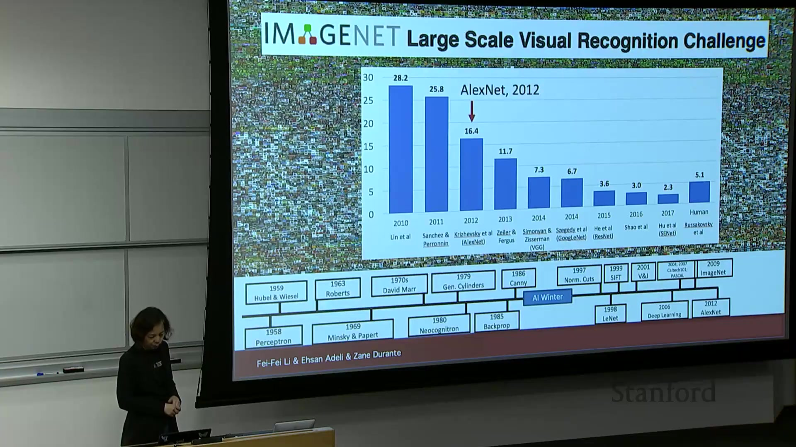

## 目录
1. 课程介绍
2. 计算机视觉在AI中的定位
3. 视觉的历史与重要性
4. 计算机视觉发展历程
5. 深度学习革命与突破
6. 计算机视觉任务与应用
7. 课程大纲与学习目标
8. 总结

---

## 1. 课程介绍
- **讲师团队**：  
  - 李飞飞（Fei-Fei Li）教授（主讲）  
  - Isara Deli教授（联合授课）  
  - Zayn助教（研究生）  
  - 18位教学助理（TAs）团队  
- **课程定位**：  
  - 专注于**计算机视觉**与**深度学习**的交叉领域  
  - 强调跨学科应用，鼓励学生将技术应用于自身专业领域  
- **课程愿景**：  
  > "AI已成为高度跨学科领域，本课程不仅教授技术，更希望学生将其应用于各自热爱的学科。" — 李飞飞

---

## 2. 计算机视觉在AI中的定位
- **AI领域划分**：  
  - 计算机视觉是AI的核心组成部分  
  - 视觉智能是智能的基石（"解锁视觉智能即解锁智能本身"）  
- **技术栈关系**：  
  ```mermaid
  graph LR
  AI --> 机器学习
  机器学习 --> 深度学习
  深度学习 --> 神经网络
  ```
- **跨学科融合**：  
  - 技术交叉：自然语言处理（NLP）、语音识别、机器人学  
  - 学科交叉：数学、神经科学、计算机科学、心理学、物理学、生物学  
  - 应用领域：医疗、法律、教育、商业等  

---

## 3. 视觉的历史与重要性
### 3.1 寒武纪大爆发（5.4亿年前）
- **关键事件**：  
  - 首次出现感光细胞（三叶虫）  
  - 视觉感知引发物种爆炸式进化  
- **进化意义**：  
  - 视觉与触觉成为最古老的感官  
  - 推动神经系统与智能发展  
- **

### 3.2 人类视觉系统
- **神经基础**：  
  - 超过50%的大脑皮层细胞参与视觉处理  
  - 复杂的视觉通路结构  
- **感知特性**：  
  - 快速识别能力（150ms内完成物体分类）  
  - 专业化脑区：面部识别、场景识别等  
- **

---

## 4. 计算机视觉发展历程
### 4.1 早期探索（1950s-1960s）
- **神经科学启发**：  
  - 1959年Hubel & Wiesel实验：发现视觉皮层神经元感受野  
  - 层级化处理机制（简单边缘→复杂模式）  
- **学科诞生**：  
  - 1963年Larry Roberts首篇计算机视觉博士论文（形状分析）  
  - 1966年MIT"夏季项目"（目标：一夏天解决视觉问题）  
- **

### 4.2 理论奠基（1970s-1980s）
- **David Marr框架**：  
  - 三级视觉处理：  
    1. 原始草图（Primal Sketch）→ 边缘检测  
    2. 2.5D草图 → 深度分离  
    3. 3D模型 → 完整空间重建  
  - 核心挑战：从2D图像恢复3D信息（不适定问题）  
- **

### 4.3 AI寒冬期（1980s-1990s）
- **技术瓶颈**：  
  - 缺乏大规模数据集  
  - 计算资源不足  
  - 算法局限（如手工设计参数）  
- **重要进展**：  
  - Fukushima的Neocognitron（卷积神经网络雏形）  
  - 1986年反向传播算法（Rumelhart, Hinton等）  
- **

---

## 5. 深度学习革命与突破
### 5.1 关键转折点
- **数据驱动**：  
  - 2000年代互联网兴起 → 数字图像激增  
  - 李飞飞团队构建ImageNet（1500万图像，2.2万类别）  
- **2012年ImageNet竞赛**：  
  - AlexNet（Hinton团队）将错误率从28%降至15%  
  - 标志现代AI/深度学习时代开端  
- **

### 5.2 技术突破要素
- **三大支柱**：  
  1. **算法**：反向传播 + 卷积神经网络（CNN）  
  2. **数据**：大规模标注数据集（如ImageNet）  
  3. **算力**：GPU计算能力指数级增长  
- **硬件演进**：  
  - NVIDIA GPU每美元算力提升（2020年后爆发式增长）  
  - 支撑万亿参数模型训练  
- **

---

## 6. 计算机视觉任务与应用
### 6.1 核心任务体系
- **基础任务**：  
  - 图像分类（Image Classification）  
  - 目标检测（Object Detection）  
  - 语义分割（Semantic Segmentation）  
  - 实例分割（Instance Segmentation）  
- **

### 6.2 高级任务
- **视频理解**：  
  - 行为识别（如跑步/跳舞）  
  - 多模态分析（视觉+音频）  
- **生成式AI**：  
  - 图像生成（DALL·E, Midjourney）  
  - 风格迁移（Style Transfer）  
  - 文本生成图像（Text-to-Image）  
- **3D视觉**：  
  - 三维重建（NeRF技术）  
  - 单视图3D检测  
- **

### 6.3 应用领域
- **医疗健康**：  
  - 放射学/病理学图像分析  
  - 老年人护理（李飞飞团队研究方向）  
- **科学探索**：  
  - 首张黑洞照片（计算摄影技术）  
- **社会影响**：  
  - 偏见问题（数据偏差导致算法偏见）  
  - 伦理挑战（就业/贷款决策等）  

---

## 7. 课程大纲与学习目标
### 7.1 四大知识模块
| 模块 | 核心内容 | 关键技术 |
|------|----------|----------|
| **深度学习基础** | 线性分类器、正则化、优化 | 损失函数、反向传播 |
| **视觉感知与理解** | 图像分类、目标检测、分割 | CNN、RNN、Transformer |
| **生成式视觉智能** | 自监督学习、生成模型 | 扩散模型、视觉语言模型 |
| **人本应用与影响** | 医疗应用、伦理问题 | 偏见缓解、可解释AI |

### 7.2 实践项目
- **Assignment 3**：实现文本生成表情符号的扩散模型  
  - 示例：输入"a face with a cowboy hat" → 生成对应表情  
- **

### 7.3 学习目标
- 掌握计算机视觉任务的形式化方法  
- 开发与训练视觉模型（图像/视频数据）  
- 理解领域前沿与未来趋势  
- 认识AI的社会影响与伦理责任  

---

##  总结
本讲系统梳理了计算机视觉的演进脉络：从5.4亿年前视觉的生物学起源，到1950年代学科诞生，再到2012年深度学习革命性突破。核心观点包括：  
1. **视觉智能是智能的基石**，驱动了生物进化与AI发展；  
2. **三大支柱（算法/数据/算力）** 共同促成现代计算机视觉的爆发；  
3. **任务体系从基础分类扩展到生成式AI与3D视觉**，应用覆盖医疗、科学、社会各领域；  
4. **技术双刃剑特性**：需警惕偏见与伦理问题，同时挖掘医疗等正向价值。  
课程将深入CNN、Transformer、扩散模型等核心技术，并强调跨学科应用与社会责任。