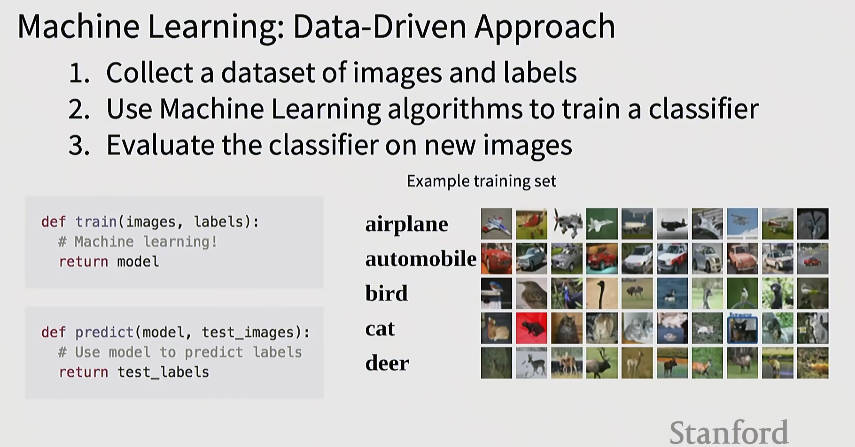
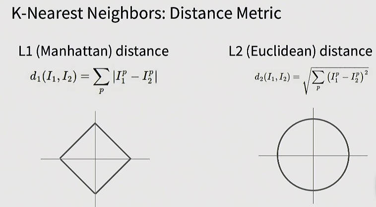
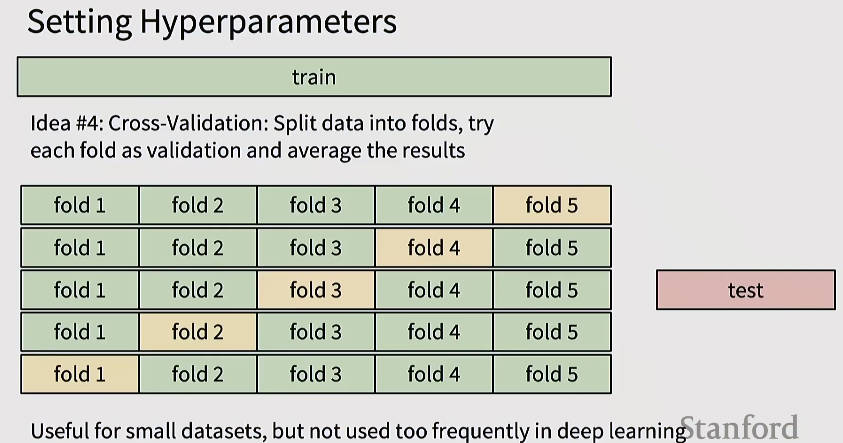

## 目录
- [目录](#目录)
- [1. **图像分类概述**](#1-图像分类概述)
- [2. **数据驱动方法**](#2-数据驱动方法)
- [3. **最近邻分类器**](#3-最近邻分类器)
- [4. **超参数调优**](#4-超参数调优)
- [5. **线性分类器**](#5-线性分类器)
- [6. **损失函数与优化**](#6-损失函数与优化)
- [总结](#总结)

---

## 1\. **图像分类概述**
- **核心任务**：为给定图像分配预定义标签（如猫、狗、飞机等）
- **技术挑战**：
  - **视角变化**：相机移动导致所有像素值改变，但人类仍识别为同一物体
  - **光照变化**：不同光照条件下相同物体的像素值差异显著
  - **背景干扰**：复杂背景影响识别准确性
  - **尺度变化**：物体在图像中的大小变化
  - **遮挡问题**：物体部分被遮挡时识别困难（如仅可见猫尾）
  - **形变问题**：物体形态变化（如猫的不同姿势）
  - **类内差异**：同一类别物体存在显著差异（如不同品种的猫）
  - **上下文依赖**：需结合场景理解（如室内环境中的猫尾）
- **数据表示**：
  - 彩色图像为三维张量（如800×600×3），RGB通道值范围0-255
  - 语义鸿沟：人类感知与机器像素级理解的差异

---

## 2\. **数据驱动方法**
- **传统方法局限**：
  - 基于规则的方法（如边缘检测→特征提取→分类）难以扩展
  - 需为每类物体手动设计规则，维护成本高
- **数据驱动三步法**：
  1. **数据收集**：构建带标签的图像数据集
  2. **模型训练**：使用机器学习算法学习图像-标签映射关系
  3. **模型评估**：在测试图像上预测标签并评估性能
- **关键优势**：避免硬编码规则，通过数据自动学习模式

 **  

---

## 3\. **最近邻分类器**
- **核心思想**：
  - 训练阶段：仅存储所有训练图像及标签（$O(1)$复杂度）
  - 预测阶段：计算测试图像与所有训练图像的距离，选择最近邻标签
- **距离度量**：
  - **L1距离（曼哈顿距离）**：
    $$
    d_1(I_1, I_2) = \sum_{p} |I_1^p - I_2^p|
    $$
    - 特征敏感，决策边界平行于坐标轴
  - **L2距离（欧氏距离）**：
    $$
    d_2(I_1, I_2) = \sqrt{\sum_{p} (I_1^p - I_2^p)^2}
    $$
    - 旋转不变性，决策边界更平滑
 **  

- **K近邻扩展（KNN）**：
  - 选择K个最近邻，通过多数投票确定标签
  - K值影响决策边界：K=1时过拟合，K增大时边界更平滑
- **性能局限**：
  - 预测复杂度高（$O(n)$，n为训练样本数）
  - 像素级距离对语义变化不敏感（如单像素偏移导致距离剧增）
  - CIFAR-10数据集上最佳准确率仅28.5%（K=7）

---

## 4\. **超参数调优**
- **关键超参数**：
  - K值（近邻数量）
  - 距离度量（L1/L2）
- **调优方法**：
  1. **训练集调优**：不可行（K=1时训练准确率100%）
  2. **测试集调优**：作弊行为（无法评估泛化能力）
  3. **验证集调优**：
     - 划分训练集为训练子集+验证集
     - 在验证集上选择最佳超参数
  4. **交叉验证**：
     - 将训练集分为K折（如5折）
     - 轮流使用每折作为验证集，平均性能
     - 更可靠但计算成本高
   ** 
- **实践建议**：
  - 大规模数据集常用单验证集
  - 学术研究需交叉验证确保结果可复现

---

## 5\. **线性分类器**
- **核心思想**：
  - 参数化方法：学习权重矩阵$W$和偏置$b$映射输入到输出分数
  - 输入图像展平为向量$x$（如32×32×3 → 3072维）
  - 输出为类别分数向量$f(x,W) = Wx + b$
- **多视角理解**：
  - **代数视角**：线性变换 $f: \mathbb{R}^D \rightarrow \mathbb{R}^C$（D为特征维度，C为类别数）
  - **模板视角**：$W$的每行对应类别的模板（如CIFAR-10中汽车模板呈现车头形状）
  - **几何视角**：决策边界为超平面，偏置$b$控制平移（避免边界过原点）
- **优势与局限**：
  - 优势：计算高效，是神经网络基础组件
  - 局限：无法处理非线性可分数据（如异或问题、环形分布）

---

## 6\. **损失函数与优化**
- **损失函数目标**：量化模型预测与真实标签的差异
- **Softmax分类器**：
  - 将分数转为概率分布：
    $$
    P(y_i = k | x_i) = \frac{e^{s_k}}{\sum_j e^{s_j}}
    $$
    其中$s_k = f(x_i, W)_k$为类别k的分数
  - 损失函数（交叉熵）：
    $$
    L_i = -\log\left(P(y_i | x_i)\right)
    $$
    - 等价于最大化正确类别概率
    - 等价于最小化KL散度
- **关键特性**：
  - 损失值范围：$[0, +\infty)$
  - 随机初始化时（$C$类）：期望损失为$\log C$（如C=10时为2.3）
- **优化目标**：寻找最小化总损失的$W$（下节课主题）

---

##  总结
本讲系统介绍了图像分类的两种基础方法：**最近邻分类器**与**线性分类器**。最近邻分类器通过距离度量实现简单分类，但存在预测效率低、语义理解弱等问题；线性分类器通过参数化学习建立输入-输出映射，是深度学习的核心组件。课程深入探讨了图像分类的挑战（如视角/光照变化）、数据驱动范式、超参数调优方法（交叉验证）、以及Softmax损失函数的数学本质（交叉熵与最大似然估计）。这些内容为后续神经网络学习奠定了关键基础，尤其强调了从像素级处理向语义理解的演进思路。