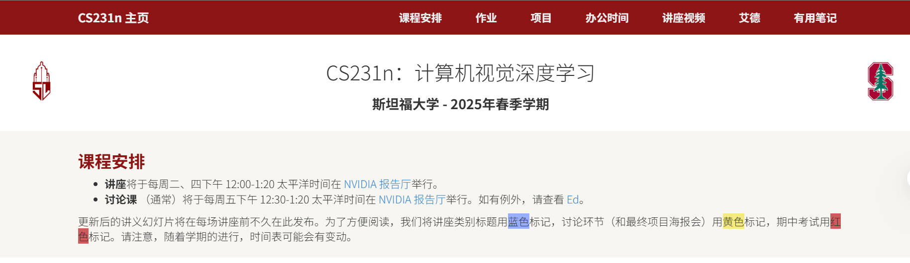

# CS231n 2025春季公开课笔记

本仓库用于记录本人学习斯坦福CS231n《计算机视觉：基础与应用》2025春季公开课时的学习笔记与资料。
- 课程主页：[CS231n 2025 Spring](https://cs231n.stanford.edu/schedule.html)
- 讲师：李飞飞等
- 内容涵盖：计算机视觉基础、深度学习、卷积神经网络、图像识别等

## 目录结构
- `Lecture1导论/`：第一讲导论相关资料与笔记
- `Lecture2线性分类器进行图像分类/`：第二讲线性分类器相关资料与笔记
- 其他讲义与笔记后续补充

## 说明
本仓库仅供个人学习与交流使用，课程版权归斯坦福大学及相关讲师所有。

欢迎交流学习心得！

---
## 免责声明
本人亦为初学者且辅以ai整理，笔记内容如有错误或不当之处，敬请批评指正！
